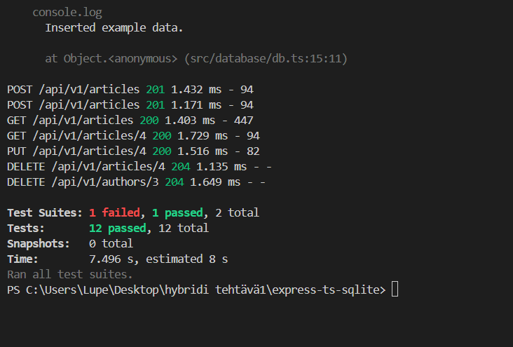

# Express TypeScript SQLite

An Express.js application template written in TypeScript using SQLite for database management.

## Table of Contents

- Introduction
- Features
- Installation
- Usage
- Contributing
- License

## Introduction

This project is an example of an Express.js application using TypeScript and SQLite. It demonstrates how to set up a simple server with TypeScript and connect it to an SQLite database.

## Features

- Express.js server setup in TypeScript
- SQLite integration
- Environment configuration

## Installation

### Prerequisites

- Node.js (version 20 or higher)
- npm

### Steps

1. Clone the repository:

   ```bash
   git clone https://github.com/ilkkamtk/express-ts-sqlite.git
   ```

2. Navigate to the project directory:

   ```bash
   cd express-ts-sqlite
   ```

3. Install the dependencies:

   ```bash
   npm install
   ```

4. Modify `src/database/db-config.ts` as needed.

## Usage

1. Start the server:

   ```bash
   npm start
   ```

2. The server will be running at `http://localhost:3000`.

## Contributing

Contributions are welcome! Please fork the repository and submit a pull request.

### Contributors

- [ilkkamtk](https://github.com/ilkkamtk) - Original Author

## License

This project is licensed under the Apache License 2.0. See the [LICENSE](https://github.com/ilkkamtk/express-ts-sqlite/blob/main/LICENSE) file for details.

POST /api/v1/articles 201 1.432 ms - 94
POST /api/v1/articles 201 1.171 ms - 94
GET /api/v1/articles 200 1.403 ms - 447
GET /api/v1/articles/4 200 1.729 ms - 94
PUT /api/v1/articles/4 200 1.516 ms - 82
DELETE /api/v1/articles/4 204 1.135 ms - -
DELETE /api/v1/authors/3 204 1.649 ms - -

Test Suites: 1 failed, 1 passed, 2 total
Tests: 12 passed, 12 total
Snapshots: 0 total
Time: 7.496 s, estimated 8 s
Ran all test suites.


